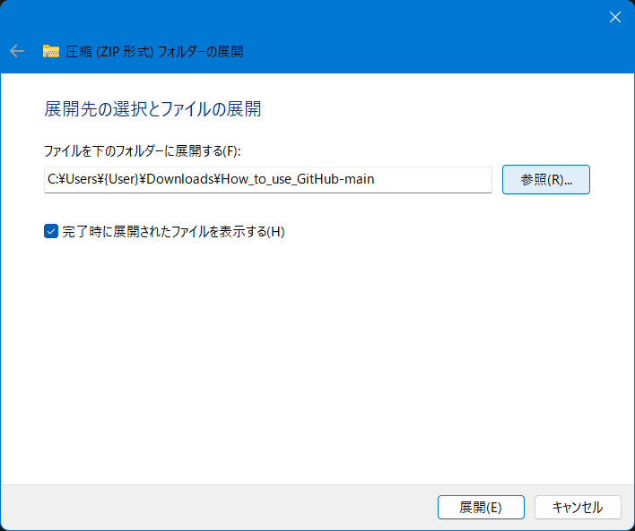
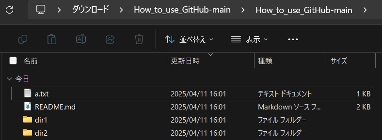

# GitHubの使い方
鳥科電装26代におけるブラウザ版のGitHubで開発を進める方針についてまとめる．

## 方針
- 必要要件は，誰による, どんな編集かが明確にわかること. 
- ローカルファイルの同期は必ずしも必須ではない. 
- Gitの構造を理解しきれていない人がいる中でGitの利用を強制するのは得策ではない. 
- 「ファイルの変更履歴を残せるクラウドストレージ」としての利用ならブラウザ版で十分と判断した. 

## 手順
|1|右上の緑の「\<\> Code」をクリックする．|  
|---|:---|
|||

|2|「Download ZIP」をクリックする．|
|---|:---|
|||

|3|任意のフォルダーで展開する．|
|---|:---|
||作業をする展開先のフォルダーをあらかじめ決めておくと良いでしょう．  |

|4|作業をする．|
|---|:---|
||ここでは，すべてのファイルに何かしらの文字を追記しましょう．|

|5|GitHubのリポジトリにアップロードする．|
|---|:---|
||右上の「Upload files」からアップロードできます．ただし，アップロードする場所を状況に応じて適切に選択してください．  **あるファイルを1つだけ編集した場合** 画像を参考に「a.txt」をアップロードしましょう．  **特定のフォルダー内にある1つのファイルを編集した場合** 画像を参考に，もともと「b.txt」があった場所（dir1）に移動してから「b.txt」をアップロードしましょう．  **特定のフォルダー内にある複数のファイルを編集した場合** 画像を参考に「c.txt」「d.txt」が入っているフォルダー（dir2）ごとドラッグ＆ドロップして，アップロードしましょう．|

